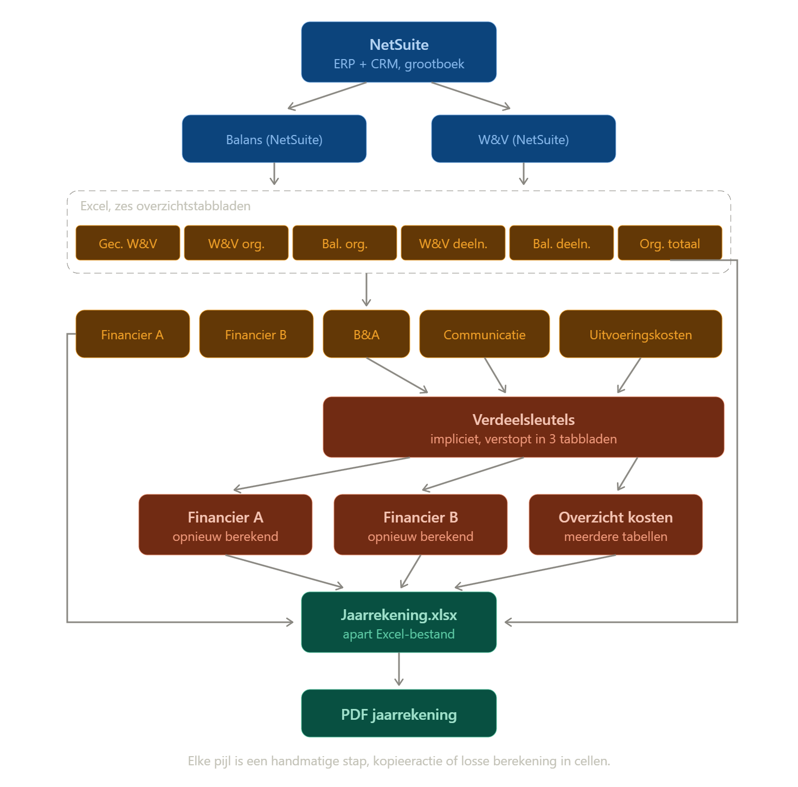

# 📊 Simplifying a Financial Reporting Process

This case study describes a project to simplify and improve an annual financial reporting process. Over time, the process had grown across multiple interdependent Excel files, with calculations, allocation keys and manual steps spread across different parts of the workflow.
The challenge was not simply to automate Excel, but to understand the process first and redesign it so that calculations, assumptions and source data were easier to trace, maintain and validate.

## 🧠 Approach

- Mapped the reporting process from **source system to annual accounts**.
- Analysed where complexity came from and which steps were necessary, duplicated or dependent on manual intervention.
- Compared different implementation options, including the source system, Power Query and Excel.
- Designed a **single formula-driven reporting model** with separate input, calculation, consolidation, control and output layers.
- Made cost allocation, allocation keys and inter-entity consolidation more transparent and traceable.
- Redesigned the loan administration and built a carrying-value model based on source-system data.
- Added internal cross-checks to identify inconsistencies between related figures.
- Documented design decisions, open questions and deliberate differences between the old and new approach.
- Prepared documentation to support handover and future maintenance.

### Before

*Figure 1 (Dutch). Overview of the reporting process before the redesign. Organisation and entity names have been anonymised.*

## 📈 Results

- Replaced multiple interdependent legacy files with a **single reporting model fed from the source system**.
- In the cost section, reduced the model from **10 worksheets with 190 distinct formulas to 3 worksheets with 43 distinct formulas**.
- Made reporting figures traceable back to their source without reconstructing intermediate steps.
- Made cost allocation, allocation keys and consolidation logic explicit and easier to review.
- Tested the reporting approach against **Dutch Accounting Guideline 650**, the relevant reporting guideline for fundraising and grant-making organisations.
- Added internal controls and cross-checks within the reporting model.
- Created handover documentation so the organisation could maintain and further develop the model.

### After

*Figure 2 (Dutch). Simplified reporting structure after the redesign.*

## 🔍 Why This Matters

Reporting processes often become more complex gradually: individual fixes, calculations and workarounds accumulate over time.

The solution is not always to move everything into a new system. First, the existing process needs to be understood: **where does the data come from, what is calculated, where is human judgement required, and where can errors occur?**

This project strengthened my experience in combining **process analysis, data modelling, Excel automation and stakeholder knowledge** to turn a complex reporting process into a more transparent and maintainable model.

## 📎 Detailed Case Study

For a more detailed description of the process analysis, model design and implementation choices, see the
[full case study (Dutch, PDF)](./DOEN_Case_Study_Detailed_NL.pdf).
