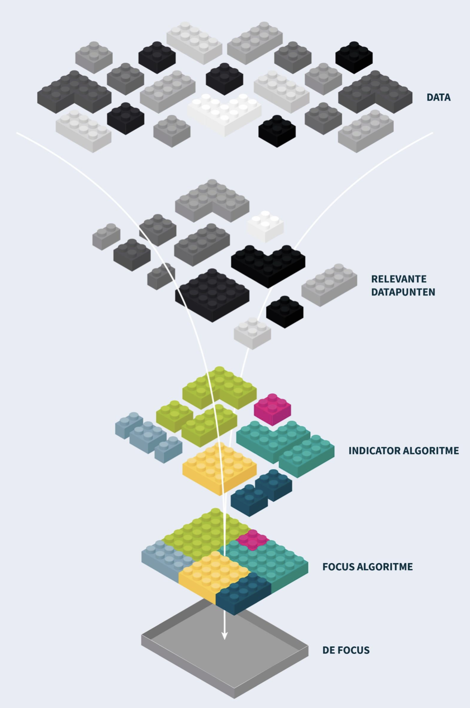
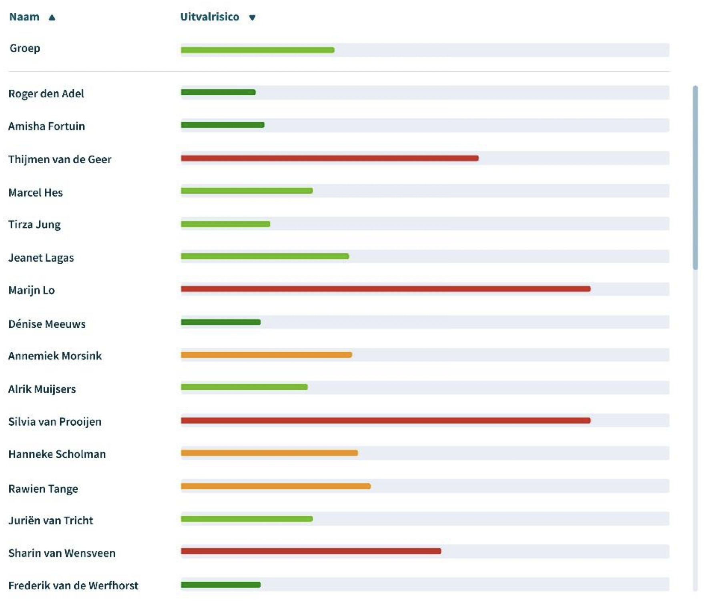
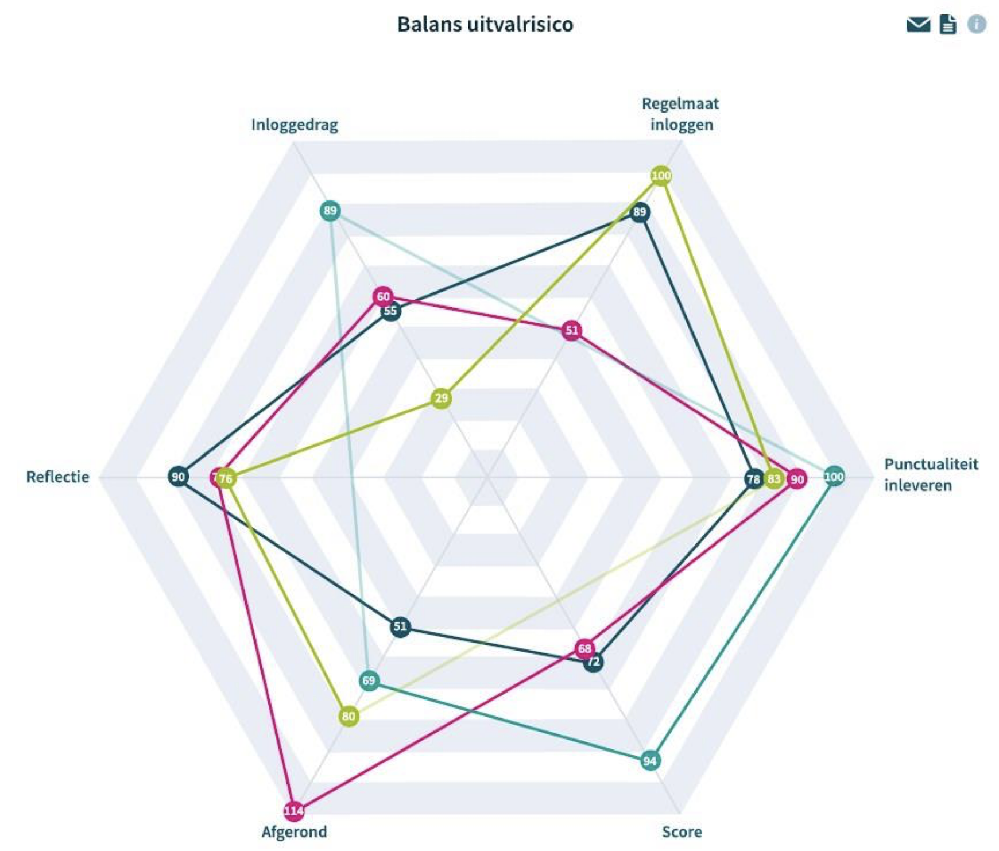

# 📊 Learning Analytics in Dutch Vocational Education

This case study was developed while working on educational innovation in Dutch vocational education. I worked at the intersection of **education, data and technology**, helping translate learning design into meaningful learning analytics and early-warning indicators.

## 🧠 Key Concepts

- **Learning Design → Analytics Mapping:** Translating course structure into measurable indicators.
- **Early Warning Indicators (EWI):** Using data to identify students at risk.
- **Dashboards for Teachers:** Clear, actionable insights based on course progression.
- **Theory to Practice:** Bridging learning theory with technical dashboards.

## 👤 My Role

- Worked with teacher teams to define what student behaviour indicates that a student is progressing as expected.
- Translated these educational expectations into **observable, measurable indicators**.
- Contributed to the development and validation of rules underlying early-warning indicators, including situations where data should **not** be interpreted as a warning signal.
- Translated the methodology into specifications for the technical data team and provided feedback when data was not sufficiently reliable.
- Documented the approach in two publications to make it reusable across programmes.

## 📈 Outcome

- A reusable methodology connecting learning design with learning analytics.
- Explicitly motivated early-warning indicators rather than metrics chosen simply because the data was available.
- Dashboards designed around the **decisions teachers need to make**, rather than around the structure of the database.
- Two publications documenting the methodology and its implementation.

## 🔍 Why This Matters

A dashboard can be technically correct and still be useless. The important question is not only **“What data do we have?”**, but **“What decision should this data help someone make?”**

This project taught me to start with the problem and the user, translate that into measurable concepts, and work with technical teams to turn those concepts into useful analytical outputs.

## 📎 Publications 

| File | Description |
|---|---|
| [Q-Sense_van learning design naar learning analytics_methodiek en verantwoording_2021.pdf](./Q-Sense_van%20learning%20design%20naar%20learning%20analytics_methodiek%20en%20verantwoording_2021.pdf) | Guidebook on translating learning design into meaningful learning analytics. |
| [Q-Sense_learning analytics recepten_methodiek en verantwoording_2021.pdf](./Q-Sense_%20learning%20analytics%20recepten_methodiek%20en%20verantwoording_2021.pdf) | Methodology for developing and validating early-warning indicators and dashboards. |

Both publications are in **Dutch** 🇳🇱, as it was created for national implementation.

## 📊 Examples from the publications: From Data to Action

### Figure 1 — The Learning Analytics Recipe

*Figure 1. Example of how data points are combined into indicators and ultimately into a learning analytics signal. Source: Q-Sense, 2021.*

### Figure 2 — Visualising Early-Warning Signals

*Figure 2. Example of how student risk signals can be visualised for teachers. Source: Q-Sense, 2021.*

### Figure 3 — Visualising Detailed Early-Warning Signals

*Figure 3. Example of how student risk signals can be visualised in detail for teachers. Source: Q-Sense, 2021.*

